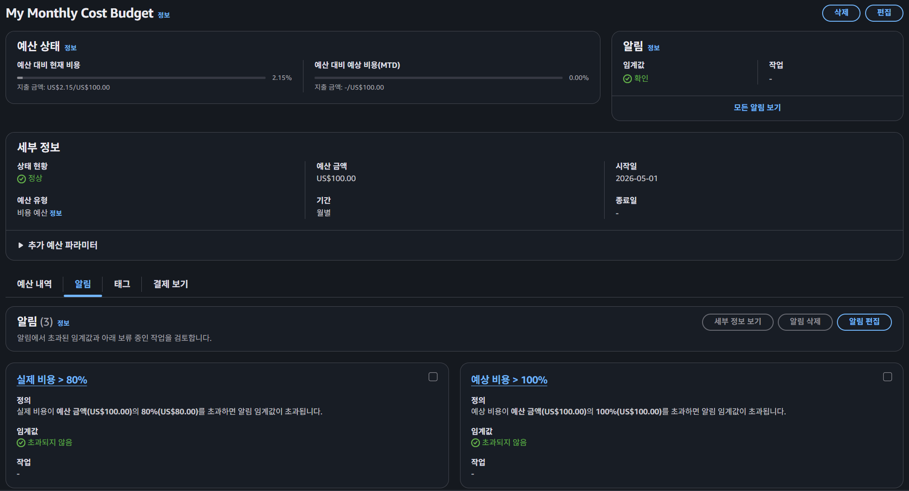
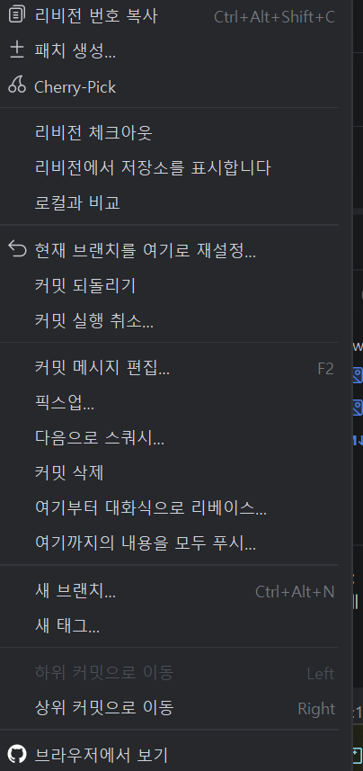
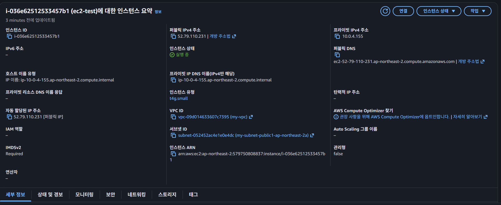

# CH4 클라우드 과제

Spring Boot 기반의 팀원 소개 서비스를 AWS에 배포하고, 데이터베이스와 파일 저장소를 분리하여 Stateless 아키텍처를 구성하는 과제입니다.  


## 1. 프로젝트 개요

이 프로젝트는 다음 목표를 중심으로 구현합니다.

- 팀원 정보 저장 및 조회 API 구현
- 운영 환경에서 동작 가능한 Spring Boot 애플리케이션 배포
- RDS, Parameter Store를 활용한 운영 DB 분리
- S3를 활용한 프로필 이미지 업로드 및 Presigned URL 조회
- 서버 장애 상황에서도 데이터가 안전한 Stateless 구조 설계

## 2. 기술 스택

- Language: Java
- Framework: Spring Boot
- Database
    - Local: H2
    - Prod: MySQL (Amazon RDS)
- Infra: AWS EC2, VPC, RDS, S3, Systems Manager Parameter Store
- Monitoring: Spring Boot Actuator

## 3. 시스템 아키텍처

### 필수 기능 기준 아키텍처

- Public Subnet에 EC2 배포
- Public Subnet에 로컬 테스트 가능한 MySQL RDS 구성
- 애플리케이션은 운영 환경에서 RDS 사용
- 민감한 DB 접속 정보는 Parameter Store에 저장
- 프로필 이미지는 S3에 저장
- S3 객체는 Presigned URL을 통해서만 조회

```text
Client
  -> EC2 (Spring Boot Application)
      -> RDS(MySQL)
      -> SSM Parameter Store
      -> S3
```

## 4. 필수 기능 구현

## LV 0. AWS Budget 설정

클라우드 실습 과정에서 과금 사고를 방지하기 위해 AWS Budget을 설정했습니다.

- 월 예산: `$100`
- 알림 기준: `80%`
- 알림 방식: 이메일

### 제출 자료

- AWS Budgets 설정 화면



## LV 1. 네트워크 구축 및 핵심 기능 배포

안전한 네트워크 환경을 구성하고, 외부에서 접속 가능한 애플리케이션을 배포했습니다.

### 1) 인프라 구성

- VPC를 생성하고 네트워크를 분리했습니다.
- Subnet을 Public / Private 구조로 설계했습니다.
- EC2는 Public Subnet에 생성하여 외부 접속이 가능하도록 구성했습니다.




