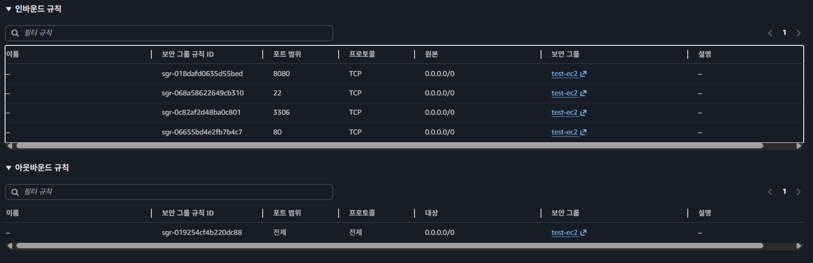
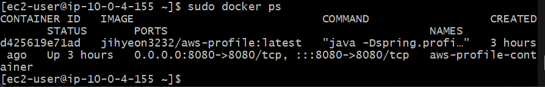

# CH4 클라우드 과제

Spring Boot 기반의 팀원 소개 서비스를 AWS에 배포하고, 데이터베이스와 파일 저장소를 분리하여 Stateless 아키텍처를 구성하는 과제입니다.  


## 1. 프로젝트 개요

이 프로젝트는 다음 목표를 중심으로 구현합니다.

- 팀원 정보 저장 및 조회 API 구현
- 운영 환경에서 동작 가능한 Spring Boot 애플리케이션 배포
- RDS, Parameter Store를 활용한 운영 DB 분리
- S3를 활용한 프로필 이미지 업로드 및 Presigned URL 조회
- 서버 장애 상황에서도 데이터가 안전한 Stateless 구조 설계

## 2. 기술 스택

- Language: Java
- Framework: Spring Boot
- Database
    - Local: H2
    - Prod: MySQL (Amazon RDS)
- Infra: AWS EC2, VPC, RDS, S3, Systems Manager Parameter Store
- Monitoring: Spring Boot Actuator

## 3. 시스템 아키텍처

### 필수 기능 기준 아키텍처

- Public Subnet에 EC2 배포
- Public Subnet에 로컬 테스트 가능한 MySQL RDS 구성
- 애플리케이션은 운영 환경에서 RDS 사용
- 민감한 DB 접속 정보는 Parameter Store에 저장
- 프로필 이미지는 S3에 저장
- S3 객체는 Presigned URL을 통해서만 조회

```text
Client
  -> EC2 (Spring Boot Application)
      -> RDS(MySQL)
      -> SSM Parameter Store
      -> S3
```

## 4. 필수 기능 구현

## LV 0. AWS Budget 설정

클라우드 실습 과정에서 과금 사고를 방지하기 위해 AWS Budget을 설정했습니다.

- 월 예산: `$100`
- 알림 기준: `80%`
- 알림 방식: 이메일

### 제출 자료

- AWS Budgets 설정 화면


## LV 1. 네트워크 구축 및 핵심 기능 배포

안전한 네트워크 환경을 구성하고, 외부에서 접속 가능한 애플리케이션을 배포했습니다.

### 1) 인프라 구성

- VPC를 생성하고 네트워크를 분리했습니다.
- Subnet을 Public / Private 구조로 설계했습니다.
- EC2는 Public Subnet에 생성하여 외부 접속이 가능하도록 구성했습니다.


### 2) 팀원 API 구현

팀원 정보를 저장하고 조회하는 API를 구현했습니다.

#### `POST /api/members`

팀원의 이름, 나이, MBTI를 입력받아 저장합니다.

예시 요청:

```json
{
  "name": "홍길동",
  "age": 27,
  "mbti": "INTJ"
}
```

예시 응답:

```json
{
  "id": 1,
  "name": "홍길동",
  "age": 27,
  "mbti": "INTJ"
}
```

#### `GET /api/members/{id}`

저장된 팀원 정보를 조회합니다.

예시 응답:

```json
{
  "id": 1,
  "name": "홍길동",
  "age": 27,
  "mbti": "INTJ",
  "profileImageUrl": null
}
```

### 3) Profile 분리

환경별 설정을 분리하여 로컬에서는 H2, 운영에서는 MySQL을 사용하도록 구성했습니다.

- `local`: H2 기반 개발 환경
- `prod`: MySQL(RDS) 기반 운영 환경

이를 통해 개발 환경과 운영 환경의 책임을 분리하고, 배포 시 운영 DB를 안정적으로 연결할 수 있도록 했습니다.


### 4) 로그 전략

운영 환경 추적을 위해 다음과 같은 로그 전략을 적용했습니다.

- API 요청 진입 시 `INFO` 레벨 로그 기록
- 예외 발생 시 `ERROR` 레벨 로그 및 스택 트레이스 기록

예시:

```text
[API - LOG] POST /api/members
```

### 5) Actuator 적용

애플리케이션의 상태 점검을 위해 Spring Boot Actuator를 적용했습니다.

- 의존성 추가: `spring-boot-starter-actuator`

```gradle
implementation 'io.awspring.cloud:spring-cloud-aws-starter-parameter-store:4.0.0-RC1'
```

예시 설정:

```properties
management.endpoints.web.exposure.include=health,info
```

### 6) 배포 결과

EC2에 애플리케이션을 배포한 뒤, 헬스 체크 응답을 확인했습니다.

#### Health Check URL

```text
http://localhost:8080/actuator/health
```

예시 응답:

```json
{"status":"UP"}
```

### 제출 자료

- EC2 Public IP

```text
http://13.125.140.82:8080
```

## LV 2. DB 분리 및 보안 연결

운영 환경의 데이터베이스를 애플리케이션과 분리하고, 민감한 설정값은 Parameter Store를 통해 주입받도록 구성했습니다.

### 1) RDS 구축

- MySQL RDS를 생성했습니다.
- 로컬 테스트가 가능하도록 Public Subnet에 배치했습니다.
- 운영 환경에서는 EC2 애플리케이션이 RDS에 연결되도록 구성했습니다.

### 2) 보안 그룹 체이닝

RDS 보안 그룹에는 직접 IP를 열지 않고, EC2 보안 그룹만 허용하도록 설정했습니다.

이 방식의 장점은 다음과 같습니다.

- 특정 서버만 DB에 접근 가능
- 불필요한 외부 접근 차단
- 운영 보안성 강화

### 3) Parameter Store 적용

DB 접속 정보를 코드에 작성하지 않고 Parameter Store에 저장했습니다.

저장 항목 예시:

- DB URL
- DB Username
- DB Password
- team-name

애플리케이션은 실행 시점에 해당 값을 읽어 운영 환경 설정으로 주입받습니다.

### 4) `/actuator/info` 확장

Parameter Store에 저장한 `team-name` 값을 `/actuator/info` 엔드포인트에서 확인할 수 있도록 구성했습니다.

예시 응답:

```json
{
  "team": {
    "name": "example-team"
  }
}
```

### 제출 자료

#### Actuator Info URL

```text
http://13.125.140.82:8080/actuator/info
```

#### RDS 보안 그룹 스크린샷



## LV 3. 프로필 사진 기능 추가와 권한 관리

프로필 이미지를 서버 로컬 디스크가 아닌 S3에 저장하도록 구현했습니다.  
이를 통해 서버 인스턴스가 교체되거나 종료되어도 이미지 데이터는 안전하게 유지됩니다.

### 1) S3 버킷 구성

- S3 버킷 생성
- 모든 퍼블릭 액세스 차단 활성화

### 2) IAM Role 기반 권한 관리

AWS 접근 키를 코드에 저장하지 않고, S3 접근 권한이 포함된 IAM Role을 EC2에 연결했습니다.

이 방식으로 다음을 보장할 수 있습니다.

- Access Key 하드코딩 방지
- 자격 증명 유출 위험 감소
- EC2 환경에서 안전한 AWS 리소스 접근

### 3) 프로필 이미지 업로드 API

#### `POST /api/members/{id}/profile-image`

이미지 파일을 Multipart 요청으로 받아 S3에 업로드하고, 업로드된 이미지의 식별 정보를 DB에 저장합니다.

주요 처리 흐름:

1. 회원 존재 여부 확인
2. 파일 유효성 검증
3. S3 업로드
4. DB에 이미지 정보 반영

### 4) 프로필 이미지 조회 API

#### `GET /api/members/{id}/profile-image`

이미지에 직접 퍼블릭 접근하지 않고, Presigned URL을 생성하여 반환합니다.

- URL 유효기간: `7일`
- 클라이언트는 발급받은 URL로만 이미지 조회 가능

예시 응답:

```json
{
  "url": "https://proflie-health-prod-fileuploads.s3.ap-northeast-2.amazonaws.com/uploads/8e9b44ed-13af-42bb-a596-9053af1a55ec_프로필.jpg?X-Amz-Security-Token=IQoJb3Jp... (중략) ...&X-Amz-Expires=604800&X-Amz-Signature=ca362441d7..."
}
```

### 제출 자료

#### Presigned URL

```text
{
  "url": "https://proflie-health-prod-fileuploads.s3.ap-northeast-2.amazonaws.com/uploads/8e9b44ed-13af-42bb-a596-9053af1a55ec_%ED%94%84%EB%A1%9C%ED%95%84.jpg?X-Amz-Security-Token=IQoJb3y...KgWGC%2Bd&X-Amz-Algorithm=AWS4-HMAC-SHA256&X-Amz-Date=20260521T015246Z&X-Amz-SignedHeaders=host&X-Amz-Credential={...}st&X-Amz-Expires=604800&X-Amz-Signature=ca3624..."
}
```

#### 만료 시간

```text
2026-05-28T10:47:53
```

#### IAM Role 방식으로 진행한 경우 대체 자료


## LV 4. Docker & CI/CD 파이프라인 구축

애플리케이션 실행 환경을 Docker 이미지로 표준화하고, GitHub Actions를 통해 Docker Hub까지 자동 배포되는 흐름을 구성했습니다.

### 1) Docker 도입

직접 EC2에 jar를 올려 `java -jar`로 실행하는 방식 대신, 애플리케이션을 Docker 이미지로 패키징하여 실행 환경 차이를 줄였습니다.

#### Dockerfile

```dockerfile
FROM eclipse-temurin:17-jdk
WORKDIR /app
COPY build/libs/*.jar app.jar
EXPOSE 8080
ENTRYPOINT ["java", "-Dspring.profiles.active=prod", "-jar", "app.jar"]
```

핵심 포인트:

- Java 17 기반 컨테이너 사용
- 빌드된 jar를 컨테이너 내부로 복사
- 컨테이너 실행 시 `prod` 프로필로 애플리케이션 시작

### 2) Docker 이미지 빌드 및 실행

#### 로컬 빌드

```bash
./gradlew clean build
```

#### Docker 이미지 생성

```bash
docker build -t aws-profile .
```

#### 로컬 컨테이너 실행

```bash
docker run -d -p 8080:8080 --name aws-profile-container aws-profile
```

### 3) Docker Hub 업로드

빌드한 이미지를 Docker Hub에 업로드하여 EC2에서 `docker pull`로 동일한 이미지를 가져와 실행할 수 있도록 구성했습니다.

#### Docker Hub 로그인

```bash
docker login -u [Docker_name]
```

#### 이미지 태그 지정

```bash
docker tag [로컬이미지명(aws-profile)] [DockerHub이름]/[이미지명:태크(aws-profile:latest)]
```

#### Docker Hub 푸시

```bash
docker push [DockerHub_Name]/aws-profile:latest
```

### 4) GitHub Actions CI/CD

`main` 브랜치에 push가 발생하면 자동으로 Gradle 빌드, Docker 이미지 생성, Docker Hub 푸시가 수행되도록 구성했습니다.

#### `.github/workflows/deploy.yml`

### 제출 자료
#### Github Actions 성공 이미지


#### EC2 터미널 이미지


## 5. API 요약

| Method | Endpoint | Description |
| --- | --- | --- |
| POST | `/api/members` | 팀원 정보 저장 |
| GET | `/api/members/{id}` | 팀원 정보 조회 |
| POST | `/api/members/{id}/profile-image` | 프로필 이미지 업로드 |
| GET | `/api/members/{id}/profile-image` | 프로필 이미지 Presigned URL 조회 |
